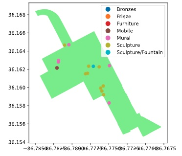

# Geospatial Data: A Guide

This document contains a guide on how to visualize and work with geospatial data, based on two courses from Datacamp:

- [Working with Geospatial Data in Python](https://app.datacamp.com/learn/courses/working-with-geospatial-data-in-python): :star: :star: :star: :star: __
- [Visualizing Geospatial Data in Python](https://app.datacamp.com/learn/courses/visualizing-geospatial-data-in-python): :star: :star: __ __ __

The datasets used during the courses are in these folders:

- [`../data/visualize_geodata`](../data/visualize_geodata)
- [`../data/work_geodata`](../data/work_geodata)

Note that 

- some exercises/tests tried on my own are located in [`lab`](./lab)
- and the slides (not committed) are in [`slides`](./slides).

Finally, here are some interesting websites with datasets for practicing:

- [European Urban Atlas](https://land.copernicus.eu/local/urban-atlas)
- [US Energy Atlas](https://atlas.eia.gov/)
- [IPIS Open Data](https://ipisresearch.be/home/maps-data/open-data/)
- [World Resources Institute](https://www.wri.org/)

Mikel Sagardia, 2023.  
No guarantees.

## Table of Contents

- [Geospatial Data: A Guide](#geospatial-data-a-guide)
  - [Table of Contents](#table-of-contents)
  - [Installation and Setup](#installation-and-setup)
  - [1. Introduction to Geospatial Vector Data](#1-introduction-to-geospatial-vector-data)
    - [1.1 Basic Visualization: Scatterplots with Background](#11-basic-visualization-scatterplots-with-background)
    - [1.2 GeoPandas Basics](#12-geopandas-basics)
    - [1.3 Visualizing Spatial Data](#13-visualizing-spatial-data)
  - [2. Spatial Relationships](#2-spatial-relationships)
    - [2.1. Shapely Geometries and Spatial Relationships](#21-shapely-geometries-and-spatial-relationships)
    - [2.2 Spatial Joins](#22-spatial-joins)
      - [Example 1: Add District Name to Bike Stations](#example-1-add-district-name-to-bike-stations)
      - [Example 2: Make a Map of the Tree Density by District](#example-2-make-a-map-of-the-tree-density-by-district)
    - [2.3 Choropleths: Mapping Attribute Data to Geometries](#23-choropleths-mapping-attribute-data-to-geometries)
  - [3. Projecting and Transforming Geometries](#3-projecting-and-transforming-geometries)
    - [3.1 Coordinate Reference Systems](#31-coordinate-reference-systems)
      - [Example 1: Transform GeoDataFrame CRS](#example-1-transform-geodataframe-crs)
      - [Example 2: Create a Point and Transform Its CRS](#example-2-create-a-point-and-transform-its-crs)
      - [Example 3: Measure Distances between Points and Plot](#example-3-measure-distances-between-points-and-plot)
    - [3.2 Spatial Operations: Creating New Geometries](#32-spatial-operations-creating-new-geometries)
      - [Example 1: Plot Dataset](#example-1-plot-dataset)
      - [Example 2: Intersection](#example-2-intersection)
    - [3.3 Overlaying Spatial Datasets](#33-overlaying-spatial-datasets)
  - [4. Case Study: Artisanal Mining Sites](#4-case-study-artisanal-mining-sites)
  - [5. Building 2-Layer Maps](#5-building-2-layer-maps)
    - [5.1 Scatterplots: Longitude and Latitude](#51-scatterplots-longitude-and-latitude)
    - [5.2 Geometries and Shapefiles: Geopandas](#52-geometries-and-shapefiles-geopandas)
    - [5.3 Combining 2 Layers: Geometry Plots and Scatterplots](#53-combining-2-layers-geometry-plots-and-scatterplots)
  - [6. Creating and Joining GeoDataFrames](#6-creating-and-joining-geodataframes)
    - [6.1 GeoJSON and Plotting with Geopandas](#61-geojson-and-plotting-with-geopandas)
    - [6.2 Projections and Coordinate Reference Systems](#62-projections-and-coordinate-reference-systems)
    - [6.3 Spatial Joins](#63-spatial-joins)


## Installation and Setup

Installation of the most important packages:

```bash
pip install shapely
pip install geopandas
pip install mapclassify # for choropleth plotting with scheme option
# Or
conda install shapely --channel conda-forge
conda install -c conda-forge geopandas
```

Additionally, spatial joins require some extra packages:

```bash
# https://stackoverflow.com/questions/67021748/importerror-spatial-indexes-require-either-rtree-or-pygeos-in-geopanda-but
pip uninstall rtree
brew install spatialindex
pip install rtree
```

## 1. Introduction to Geospatial Vector Data

We have mainly two types of geodata:

- Raster: grid with values, e.g., altitude or images (RGB, heat, anything).
- Vector: points, lines and polygons.


The course focuses on vector data, i.e.,

- Points: `(x,y)` (e.g., cities on a map).
- Lines; `[(x,y), (x,y), (x,y), ...]` (e.g., rivers on a map).
- Polygons (and multipolygons): they close and contain an area (e.g., countries on a map).


**IMPORTANT**: This section has an associated notebook where I try the code snippets summarized here:

[`lab/01_Intro_GeoPandas.ipynb`](./lab/01_Intro_GeoPandas.ipynb)

### 1.1 Basic Visualization: Scatterplots with Background

We can plot points with regular (scatter) plots and we can add background maps with the package [`contextily`](https://contextily.readthedocs.io/en/latest/).

:warning: Contextily assumes that your data is in the Web Mercator projection, the system used by most web tile services: `EPSG:3857`. See the section [3. Projecting and Transforming Geometries](#3-projecting-and-transforming-geometries) to see how to check and fix that.

```python
# Import pandas and matplotlib
import pandas as pd
import matplotlib.pyplot as plt
import contextily

# Read the restaurants csv file
restaurants = pd.read_csv("paris_restaurants.csv")

# Inspect the first rows of restaurants
print(restaurants.head())
#                                               type           x          y
# 0                             Restaurant européen  259641.692  6.252e+06
# 1                Restaurant traditionnel français  259572.340  6.252e+06

# Make a plot of all points: scatterplot
fig, ax = plt.subplots()
ax.plot(restaurants.x, restaurants.y, 'o')
plt.show()

# To add a background map: contextily
# !pip install contextily
# It automatically downloads the tile of the required region
# But the X & Y or Long & Lat need to be correct
fig, ax = plt.subplots()
ax.plot(restaurants.x, restaurants.y, 'o', markersize=1)
contextily.add_basemap(ax)
plt.show()
```

### 1.2 GeoPandas Basics

GeoPandas is an extension to Pandas which can contain geodata. It has always a `geometry` column, which contains often the polygons of given regions/areas. The rest of the columns are the attributes of the elements that represent those polygons.

Note that:

- The dataframes become of type `GeoDataFrame`. They have special properties and methods, like `plot()`, which nicely plots the geometries.
- The `geometry` column is of type `GeoSeries`, equivalent to the Pandas `Series`, but for geometrical data; it has several special attributes/properties, like `area`.

```python
import geopandas as gpd

# Read the Paris districts dataset: GeoPackage file
districts = gpd.read_file('paris_districts.gpkg')

# Inspect the first rows
print(districts.head())

# Make a quick visualization of the districts
districts.plot()

type(districts) # geopandas.geodataframe.GeoDataFrame
type(districts.geometry) # geopandas.geoseries.GeoSeries

# Area attribute
districts.geometry.area

# Convert CSV to GeoPandas
df = pd.read_csv("paris_restaurants.csv")
restaurants = gpd.GeoDataFrame(df, geometry=gpd.points_from_xy(df.x, df.y))

# Calculate the number of restaurants of each type
type_counts = restaurants.groupby('type').size()

# Take a subset of the African restaurants
african_restaurants = restaurants[restaurants['type'] == 'African restaurant']
```

### 1.3 Visualizing Spatial Data

If we use `.plot()` on a `GeoDataFrame`, the `geometry` column will be plotted, i.e., the polygons contained in it. We can further control the plots:

- If we pass the `color` attribute, we can specify the color for all geometries.
- `column`: we specify the values of which other column should be plotted in the displayed polygons.
- `cmap`: [color maps](https://matplotlib.org/stable/tutorials/colors/colormaps.html).
- We can overlay other plot son the plotted polygons (e.g., scatterplots or points) by using the `ax` option.
- We can add a legend and control it passing a dictionary via `legend_kwds`.
- We can use any pandas and matplotlib functions, basically.

```python
# Add a population density column
# Watch out: area is in m2, we want to pass it to km2 -> /10^6
districts['population_density'] = (districts.population / districts.geometry.area) * 10**6

# Make a plot of the districts colored by the population density
districts.plot(column = 'population_density', cmap = 'Reds', legend=True, figsize=(10, 5))

# Take a subset of the African restaurants
african_restaurants = restaurants[restaurants['type'] == 'African restaurant']

# Make a multi-layered plot
fig, ax = plt.subplots(figsize=(10, 10))
restaurants.plot(ax=ax, color='grey')
african_restaurants.plot(ax=ax, color='red')
# Remove the box, ticks and labels
ax.set_axis_off()
plt.show()
```

## 2. Spatial Relationships

Geometries are represented by [Shapely](https://shapely.readthedocs.io/en/stable/) objects in the `geometry` column of a `GeoDataFrame` in geopandas; these can be `Point`, `LineString`, `Polygon`, etc. Thanks to them, we can apply spatial operations.

**IMPORTANT**: This section has an associated notebook where I try the code snippets summarized here:

[`lab/02_Spatial_Relationships.ipynb`](./lab/02_Spatial_Relationships.ipynb)

### 2.1. Shapely Geometries and Spatial Relationships

[Shapely](https://shapely.readthedocs.io/en/stable/) is a package on its own and we can use it to create geometric objects manually, too. Shapely supports many attributes out of the box:

- `obj.area`
- `obj1.distance(obj2)`
- `obj1.contains(obj2)`
- `within()`
- `touches()`
- `intersects()`
- `centroid`
- ...

Additionally, almost all shapely object functions/attributes have an equivalent in geopandas. That way, we get GeoSeries or series of values. If these are boolean (e.g., the result of applying `contains`), we can use those series as masks in the geodataframes.

```python
# Import the Point geometry
from shapely.geometry import Point

# Construct a point object for the Eiffel Tower
eiffel_tower = Point(255422.6, 6250868.9)

# Print the result
print(eiffel_tower)

# Accessing the Montparnasse geometry (Polygon) and restaurant
district_montparnasse = districts.loc[52, 'geometry']
resto = restaurants.loc[956, 'geometry']

# Is the Eiffel Tower located within the Montparnasse district?
print(eiffel_tower.within(district_montparnasse))

# Does the Montparnasse district contain the restaurant?
print(district_montparnasse.contains(resto))

# The distance between the Eiffel Tower and the restaurant?
print(eiffel_tower.distance(resto))

# Create a boolean Series
mask = districts.contains(eiffel_tower)

# Filter the districts with the boolean mask
print(districts[mask])

# The distance from each restaurant to the Eiffel Tower
dist_eiffel = restaurants.distance(eiffel_tower)

# The distance to the closest restaurant
print(dist_eiffel.min())

# Filter the restaurants for closer than 1 km
restaurants_eiffel = restaurants[dist_eiffel<1000]

# Make a plot of the close-by restaurants
ax = restaurants_eiffel.plot(figsize=(10,10))
gpd.GeoSeries([eiffel_tower]).plot(ax=ax, color='red')
contextily.add_basemap(ax)
ax.set_axis_off()
```

Note: to plot a Shapely geometry using geopandas, use `GeoSeries`:

```python
import geopandas as gpd
from shapely.geometry import Point

# Create the shapely object, e.g. a point
eiffel_tower = Point(255422.6, 6250868.9)

# Create a GeoSeries with one Shapely object
# Obviously, this example doesn't make sense, because we have only a point!
gpd.GeoSeries([eiffel_tower]).plot()
```

### 2.2 Spatial Joins

Spatial joins make possible many geospatial analyses; for instance, if we have two geometry maps of a city, one with neighborhoods/districts and the other with public school points and their regions, we can ask: do they match? which districts have several schools or which schools contain several districts?

Spatial joins are done with 

    gpd.sjoin(left_df=gdf1, right_df=gdf2, op=...)

Data from the right dataframe is added to the left one. The operation, `op`, can be:

- `'intersects'`: all points/data which intersect both dataframes are returned.
- `'contains'`: data contained in the `geometry` of the first/left dataframe.
- `'within'`: data contained in the `geometry` of the second/right dataframe.
- If we don't pass an operation, both datasets are shown.

Since in one geometry column can be district polygons and the other schools points, a join can filter points (schools) within polygons (districts). Thus, we're performing geometry operations.

Note that:

- All the specified columns of the left dataframe are returned.
- All the specified columns of the right dataframe are returned, **except the `geometry` column**. The `geometry` of the right is used for the join, but not added to the joined dataframe. Only the `geometry` of the left appears in the joined dataframe.

#### Example 1: Add District Name to Bike Stations

```python
districts = gpd.read_file(DATA_PATH_PARIS+'paris_districts_utm.geojson')
stations = gpd.read_file(DATA_PATH_PARIS+'paris_sharing_bike_stations_utm.geojson')

districts.head()
# 	  id	district_name	          population	  geometry
# 0	  1	  St-Germain-l'Auxerrois  1672	        POLYGON ((451922.133 5411438.484, 451922.080 5...
# ...

stations.head()
#   name	                  bike_stands	available_bikes	geometry
# 0	14002 - RASPAIL QUINET  44	        4	              POINT (450804.449 5409797.268)
# ...

# Add district name where each station is located
joined = gpd.sjoin(left_df=stations, right_df=districts, op='within')
joined.head()
# name bike_stands available_bikes geometry index_right id district_name population
```

#### Example 2: Make a Map of the Tree Density by District

```python
districts = gpd.read_file(DATA_PATH_PARIS+'paris_districts_utm.geojson')
trees = gpd.read_file(DATA_PATH_PARIS+'paris_trees_small.gpkg')

trees.head()
#   species	    location_type	  geometry
# 0	Marronnier	Alignement	    POINT (455834.122 5410780.606)
# ...

# 1. Add to each tree the district it belongs to
joined = gpd.sjoin(left_df=trees,
                   #right_df=districts[['district_name', 'geometry']],
                   right_df=districts,
                   op="within")
joined.head()
# species	location_type	geometry	index_right	id	district_name	population

# 2. Calculate the number of trees in each district
trees_by_district = joined.groupby('district_name').size()

# 3. Convert the series to a DataFrame and specify column name
trees_by_district = trees_by_district.to_frame(name='n_trees')
trees_by_district.head()
# n_trees   district_name	
# Amérique	183
# ...

# 4. Merge the 'districts' and 'trees_by_district' dataframes
districts_trees = pd.merge(left=districts,
                           right=trees_by_district,
                           on='district_name')

# 5. Add a column with the tree density
districts_trees['n_trees_per_area'] = (districts_trees.n_trees / districts_trees.geometry.area)*10**6

# 6. Make of map of the districts colored by 'n_trees_per_area'
# Color maps can be controled with cmap: https://matplotlib.org/stable/tutorials/colors/colormaps.html
districts_trees.plot(column='n_trees_per_area',
                     legend=True,
                     figsize=(7,7))

```

### 2.3 Choropleths: Mapping Attribute Data to Geometries

From the [Wikipedia](https://en.wikipedia.org/wiki/Choropleth_map):

> A **choropleth** map is a type of statistical thematic map that uses pseudocolor, i.e., color corresponding with an aggregate summary of a geographic characteristic within spatial enumeration units, such as population density or per-capita income.

Recall that a geodataframe has a `geometry` column and the rest of the columns are called *attribute* columns. When we plot a geodataframe, the `geometry` elements are plotted, and if these are polygons, we need to specify which attribute to plot in the `column` argument. The result is a **choropleth**, as the one shown in the previous example.

An important aspect when plotting are color maps, `cmap`, because they help understand the polygons in one way or another: [Choosing Colormaps in Matplotlib](https://matplotlib.org/stable/tutorials/colors/colormaps.html). Color maps can be:

- Qualitative: miscellaneous colors, no ordering, for categorical data.
- Sequential (graduated): numerical information, with ordering/degree.
- Diverging (graduated): they start in the middle.
- Cyclic: start and end with the same color

Numerical columns default to continuous sequential color maps, however, it's better to define ranges with the arguments `scheme` and `k`:

- Choose `scheme=quantiles` or `scheme=equal_interval` depending on how we want to define the bins.
- Choose the number of bins `k` between 3 and 12.
- Always plot the distribution of the numerical value to see how to best define the bins.

```python
# Make a choropleth of the number of trees 
districts_trees.plot(column='n_trees', legend=True)
plt.show()

# Make a choropleth of the number of trees / area
districts_trees.plot(column='n_trees_per_area', legend=True)

# Generate the choropleth and store the axis
ax = districts_trees.plot(column='n_trees_per_area',
                          scheme='quantiles',
                          k=7,
                          cmap='YlGn',
                          legend=True)

# Remove frames, ticks and tick labels from the axis
ax.set_axis_off()

# Histogram plots
import seaborn as sns
districts_trees['n_trees_per_area'].hist(bins=30)
sns.histplot(districts_trees['n_trees_per_area'], bins=30, kde=True)

# Set up figure and subplots
fig, axes = plt.subplots(nrows=2, figsize=(10,10))

# Plot equal interval map
districts_trees.plot(column='n_trees_per_area', scheme='equal_interval', k=5, legend=True, ax=axes[0])
axes[0].set_title('Equal Interval')
axes[0].set_axis_off()

# Plot quantiles map
districts_trees.plot(column='n_trees_per_area', scheme='quantiles', k=5, legend=True, ax=axes[1])
axes[1].set_title('Quantiles')
axes[1].set_axis_off()

# Display maps
plt.show()
```

## 3. Projecting and Transforming Geometries

This section introduces coordinate reference systems (CRS) and, projections and transformations.

**IMPORTANT**: This section has an associated notebook where I try the code snippets summarized here:

[`lab/03_CRS_Projections_Transformations.ipynb`](./lab/03_CRS_Projections_Transformations.ipynb)

The most common way to express the location on a spot in the world are the **geographic coordinates**, which are expressed in:

- Longitude: `[-180, 180] deg`; related to `x`, starting at the Equator.
- Latitude: `[-90, 90] deg`; related to `y`, starting at the Greewich meridian.


The **geographic coordinates** are a **Coordinate Reference System** or **CRS**, because they set a frame in which we can define points. In practice, there are many CRS, depending on our application, and we apply **projections** to go from one to the other.

For instance, the geographic coordinates are not the best CRS to measure distances between points, thus we need to project the CRS to get `(x, y)` values. One possible projection or CRS is Mercator.

### 3.1 Coordinate Reference Systems

We can get the CRS in which a geodataframe is expressed with `.crs`; some popular CRS are:

- `EPSG:4326` or `WGS84`: geographic coordinates, i.e., longitude & latitude.
- `EPSG:3857`: Web Mercator, a very common projection, which has units in meters and is used in Google maps and most other apps.

To manipulate different geo-datasets, we need to make sure they're all in the same CRS. Additionally, note that:

- **All CRS projections introduce deformations. Each country/region has a best projection CRS for accurate distance computations**. See:
  - [https://spatialreference.org](https://spatialreference.org)
  - [https://epsg.io](https://epsg.io)
- Any distancce operation in geopandas/shapely expects points described on a cartesian plane. However, CRS manipulation is done only in geopandas, i.e., shapely objects work simply with cartesian floating point values.

#### Example 1: Transform GeoDataFrame CRS

```python
districts = gpd.read_file(DATA_PATH_PARIS+'paris_districts_utm.geojson')

print(districts.crs)
# epsg:32631

# If a geodataframe has no CRS, we get {}
# We can add manually a CRS as follows
gdf.crs = {'init': 'epsg:4326'}

# We can convert a geodataframe to another CRS as follows
districts = districts.to_crs(epsg = 3857)

# To make sure we correctly transform two geodataframes to the same CRS
gdf1 = geopandas.read_file(...)
gdf2 = geopandas.read_file(...)
gdf2 = df2.to_crs(gdf1.crs)
```

#### Example 2: Create a Point and Transform Its CRS

```python
# Construct a Point object for the Eiffel Tower
from shapely.geometry import Point
eiffel_tower = Point(2.2945, 48.8584) # Logitude, Latitude

# Put the point in a GeoSeries with the correct CRS
s_eiffel_tower = gpd.GeoSeries([eiffel_tower], crs={'init': 'EPSG:4326'})

# Convert to other CRS
s_eiffel_tower_projected = s_eiffel_tower.to_crs(epsg=2154)

# Print the projected point
print(s_eiffel_tower_projected)
```

#### Example 3: Measure Distances between Points and Plot

```python
restaurants = pd.read_csv(DATA_PATH_PARIS+"paris_restaurants.csv")
restaurants = gpd.GeoDataFrame(restaurants,
                               geometry=gpd.points_from_xy(restaurants.x,
                                                           restaurants.y))

print(restaurants.crs) # None
# Restaurants are in the Web Mercator CRS
# Set it manually
restaurants.crs = {'init': 'epsg:3857'}

# Extract the single Point
eiffel_tower = s_eiffel_tower_projected[0]

# Ensure the restaurants use the same CRS
restaurants = restaurants.to_crs(crs=s_eiffel_tower_projected.crs) 

print(f"New CRS: {restaurants.crs}") # New CRS: epsg:2154

# The distance from each restaurant to the Eiffel Tower
dist_eiffel = restaurants.geometry.distance(eiffel_tower)

# The distance to the closest restaurant
print(dist_eiffel.min()) # 303.5625538786418

# Contextily requires the Web Mercator CRS
# Convert to the Web Mercator projection
restaurants_webmercator = restaurants.to_crs(epsg=3857)

# Plot the restaurants with a background map
ax = restaurants_webmercator.plot(markersize=1)
contextily.add_basemap(ax)
plt.show()
```

### 3.2 Spatial Operations: Creating New Geometries

We can perform spatial operations with the polygons in such a way that we get new polygons; such oprations are:

- `a.intersection.(b)`
- `a.union.(b)`
- `a.difference.(b)`

If we apply those operations between two `gpd` tables, we get a `GeoSeeries` with the same number of rows (but one column: `geometry`). Depending on the operation, these geometries can be: the same as before, different (result of the operation, e.g., intersection), or null/empty.

    gdf.intersection(box)

The next examples use a simplified version of Donstia-San Sebastian land use dataset based on the open [European Urban Atlas](https://land.copernicus.eu/local/urban-atlas).  Go to the web, log in, select map/atlas and city, and download it!

#### Example 1: Plot Dataset

```python
# Import the land use dataset
DATA_PATH = "../../data/Donostia_Urban_Atlas/Data/"
land_use = gpd.read_file(DATA_PATH+'ES510L1_DONOSTIA_SAN_SEBASTIAN_UA2018_v013.gpkg')

# Make a plot of the land use with 'class' as the color
# https://matplotlib.org/stable/api/_as_gen/matplotlib.pyplot.legend.html#matplotlib.pyplot.legend
land_use.plot(column='class_2018',
              legend=True, 
              figsize=(15, 10),
              legend_kwds={'loc': 'lower right',
                           'bbox_to_anchor': (1.7, 0.1)})
plt.show()

# Add the area as a new column
land_use['area'] = land_use.geometry.area

# Calculate the total area for each land use class
total_area = land_use.groupby('class_2018')['area'].sum() / 1000**2
print(total_area.sort_values(ascending=False))
```

#### Example 2: Intersection

```python
from shapely import Polygon
from shapely.geometry import box

# I have taken the coordinates which enclose the city center
# For more information on how to create Shapely objects
# https://shapely.readthedocs.io/en/stable/manual.html
center_polygon = box(minx=3347000, miny=2322000, maxx=3357000, maxy=2325000, ccw=True)

# Note that we pass a Shapely object to the geodataframe
land_use_intersection = land_use.intersection(center_polygon)
land_use_intersection.plot(figsize=(15,10))

# Note that the intersected object is a GeoSeries
# which has the same number of rows as the original gdf
# BUT one column (geometry), and additionally,
# some rows have NaN/Null value, i.e., those which do not overlap!
# The new geometries can be: same as before, intersected, or empty.
# In order to get their attributes we need to perform a join/concat.
type(land_use_intersection) # geopandas.geoseries.GeoSeries

land_use_intersection.shape # (5976,)
land_use.shape # (5976, 12)
```

### 3.3 Overlaying Spatial Datasets

The `gdf.intersection(geom)` operation is limited because 

- we can instersct a `gdf` with a single polygon/geometry;
- we get a `GeoSeries` without attributes, just geometries, i.e., we don't preserve the attributes.

A more sophisticated alternative to `intersection` is `overlay`. When we perform this operation:

- we use a `gdf` and overlay to it another `gdf`, not just a polygon/geometry;
- we get `gdf` back with attributes and with all possible combinations of intersected geometries.

Example: we have two `gdf`s, (1) European countries and (2) geological regions; when we apply

```python
gpd.overlay(countries, geological_regions, how='intersection')
```

we get more geometries than countries or geological regions (i.e., all possible intersection combinations), each with their attributes.


#### Example 1: Intersection Overlay in San Sebastian

```python
# Import the districts dataset
# https://www.donostia.eus/datosabiertos/dataset/mapa_auzoak/resource/1ae83785-b6ac-466f-9548-0834143967fc?view_id=4eea417c-3f47-407d-bb7d-c7e1cfaeec2b
districts = gpd.read_file(DATA_PATH+'donostia_auzoak.json')
districts.head()

districts.shape # (20, 4)
land_use.shape # (5976, 12)

# Transform to the same CRS
districts = districts.to_crs(crs=land_use.crs)

# Overlay both datasets based on the intersection
combined = gpd.overlay(land_use, districts, how='intersection')

combined.head()
combined.shape # (2243, 15)
```

#### Example 2: Intersection Inspection

```python
# Add the area as a column
combined['area'] = combined.geometry.area

# Take a subset for the one district
land_use_district = combined[combined.name == "IGELDO"]

# Visualize the land use of the selected district
# https://matplotlib.org/stable/api/_as_gen/matplotlib.pyplot.legend.html#matplotlib.pyplot.legend
land_use_district.plot(column = 'class_2018', 
                       figsize=(10,10),
                       legend=True,
                       legend_kwds={'loc': 'lower right',
                                   'bbox_to_anchor': (1.7, 0.1)})
plt.show()

# Calculate the total area for each land use class
print(land_use_district.groupby('class_2018')['area'].sum() / 1000**2)
```

## 4. Case Study: Artisanal Mining Sites

In this section, a case study is analyzed: artisanal mining sites in Congo. The data set is from [IPIS: International Peace Service](https://ipisresearch.be). It contains information about the mines: location, minerals being mined, social insecurity situation. More information: [IPIS Open Data Tutorial](https://ipisresearch.be/wp-content/uploads/2018/03/Open_Data_Tutorial.html).

Links to explore the dataset source repositories:

- [IPIS Open Data](https://ipisresearch.be/home/maps-data/open-data/)
- [World Resources Institute](https://www.wri.org/)
- [Open Africa](https://open.africa/dataset/democratic-republic-of-the-congo-protected-areas-2016/resource/29c269ba-6ab1-4718-a958-1873f5d80127)

New concepts/methods are introduced, too.

**IMPORTANT**: This section has an associated notebook where I try the code snippets summarized here:

[`lab/04_Case_Study_Mining.ipynb`](./lab/04_Case_Study_Mining.ipynb)

### 4.1 File Formats

There are many file formats supported by Geopandas, with pros/cons:

- ESRI Shapefiles: most extended, but distributed in several files, all necessary: `.shp`, `.dbf`, `shx`, `.prj`.
- `GeoJSON`: lightweight, often used in web applications. 
- GeoPackage: `.gpkg`, new, with more capabilities
- ...
- Geopandas can also read from geo-databases, like [PostGIS](https://postgis.net/), a spatial databse extender for PostgreSQL.

Geopandas can read and write those files: `.to_file()`:

```python
# Writing a Shapefile file
# Warning: several files created - all necessary!
geodataframe.to_file("mydata.shp", driver='ESRI Shapefile')

# Writing a GeoJSON file
geodataframe.to_file("mydata.geojson", driver='GeoJSON')

# Writing a GeoPackage file
geodataframe.to_file("mydata.gpkg", driver='GPKG')
```

### 4.2 Explore the Dataset

```python
import geopandas as gpd
import matplotlib.pyplot as plt

DATA_PATH = "../../data/work_geodata/Mines/"

# Read the mining site data
mining_sites = gpd.read_file(DATA_PATH+"ipis_cod_mines.geojson")

# Print the first rows and the CRS information
mining_sites.head()
#   visit_date	name	    n_workers	mineral	geometry
# 0	2013-03-27	Mayi-Tatu	150.0	    Gold	  POINT (29.66033 1.01089)
# ...
mining_sites.shape # (2143, 5)
print(mining_sites.crs) # epsg:4326

# Make a quick visualisation
mining_sites.plot(figsize=(10,10))

# Read the Congo protected areas data
protected_areas = gpd.read_file(DATA_PATH+"wdpamay2017cod-shapefile-polygons.geojson")

# Convert both datasets to UTM projection
mining_sites_utm = mining_sites.to_crs(epsg=32735)
protected_areas_utm = protected_areas.to_crs(epsg=32735)

# Visualize both datasets
ax = protected_areas_utm.plot(color='orange',
                              figsize=(10,10))
mining_sites_utm.plot(ax=ax,
                      markersize=5,
                      column='mineral',
                      #alpha=0.5,
                      legend=True,
                      legend_kwds={'loc':'upper left'})
ax.set_axis_off()
plt.show()

# Write converted data to a file
# Warning: With SHP, several files created - all necessary!
mining_sites_utm.to_file(DATA_PATH+"ipis_cod_mines_utm.gpkg", driver='GPKG')
protected_areas_utm.to_file(DATA_PATH+"cod_conservation_utm.shp", driver='ESRI Shapefile')
```


## 5. Building 2-Layer Maps

:warning: **I made this section before the previous ones, but its contents are mostly contained in the previous ones.**

In this section scatterplots and shapely geometry plots are combined to build 2-layer map visualizations.

### 5.1 Scatterplots: Longitude and Latitude

Geospatial data comes often in longitude (=x) and latitude (y). These values can be plotted with a scatterplot; example of a scatterplot

```python
# Import matplotlib.pyplot
import matplotlib.pyplot as plt

# Scatterplot 3
plt.scatter(df.father_height, df.son_height,  c = 'yellow', edgecolor = 'darkblue')
plt.grid()
plt.xlabel('father height (inches)')
plt.ylabel('son height (inches)')
plt.title('Son Height as a Function of Father Height')

# Show your plot
plt.show()
```

Longitude and latitude, if they have been processed, often come in a tuple; we usually extract the values and create one columns for each value:

```python
# print the first few rows of df 
print(df.head())

# extract latitude to a new column: lat
df['lat'] = [loc[0] for loc in df.Location]

# extract longitude to a new column: lng
df['lng'] = [loc[1] for loc in df.Location]

# print the first few rows of df again
print(df.head())
```

### 5.2 Geometries and Shapefiles: Geopandas

We have two important packages to deal with geometries:

- [Shapely](https://shapely.readthedocs.io/en/stable/): Python package for manipulation and analysis of planar geometric objects.
- [GeoPandas](https://geopandas.org/en/stable/): extends Pandas to be able to manipulate Shapely geomatries.

A shapefile contains these components/files:

- `my_map.shp`: geometry
- `my_map.dbf`: attributes of geometry
- `my_map.shx`: links the attributes to the geometry

The geometries can have these elements:

- Points.
- Lines: segments consisting of joined Points (they can be curvy).
- Polygon: closed Lines which contain an area.


```python
# Import geopandas
import geopandas as gpd
import matplotlib.pyplot as plt

# Read in the services district shapefile and look at the first few rows.
df = gpd.read_file(shapefile_path)
print(df.head())
#    area_sq_mi  objectid                       name                                           geometry
# 0       198.0       0.0    Urban Services District  POLYGON ((-86.68681 36.28671, -86.68706 36.285...
# 1       327.0       4.0  General Services District  MULTIPOLYGON (((-86.56776 36.03424, -86.56783 ...

# Print the contents of the service districts geometry in the first row
print(df.loc[0, 'geometry'])
# POLYGON ((-86.68680500011935 36.28670500013504, -86.68706099969657 ...

# Plot the Service Districts without any additional arguments
df.plot()
plt.show()

# Plot the Service Districts, color them according to name, and show a legend
df.plot(column = 'name', legend = True)
plt.show()
```


### 5.3 Combining 2 Layers: Geometry Plots and Scatterplots

Here, we have two dataframes: `service_district` with geometries, `chickens` with longitude and latitude coordinates. We can overlay the plots.

```python
# Import geopandas
import geopandas as gpd
import matplotlib.pyplot as plt

# Plot the service district shapefile
service_district.plot(column="name", legend=True)

# Add the chicken locations
plt.scatter(x=chickens.lng, y=chickens.lat, c="black", edgecolor = 'white')

# Add labels and title
plt.title('Nashville Chicken Permits')
plt.xlabel("longitude")
plt.ylabel("latitude")

# Add grid lines and show the plot
plt.grid()
plt.show()
```


## 6. Creating and Joining GeoDataFrames

:warning: **I made this section before the previous ones, but its contents are mostly contained in the previous ones.**

Besides Shapely geometry files, we have GeoJSON files, which can be read by Geopandas, too. They have these advantages:

- They integrate everything in a JSON file.
- They are easier to handle, since JSON is a human readable/friendlier format.

### 6.1 GeoJSON and Plotting with Geopandas

GeoJSON files con contain the same structures as Shapely files. They can represent maps as

- Vector data: points, lines, polygons, multi-polygons.
- Raster data: pixel graphics, grids.

Geopandas requires some packages to deal with these structures; we have these options:

- Fiona: support for OGR, which translates vector data.
- GDAL & OGR: which translate raster data (GDAL) and vector data (OGR).

We'll deal with vector data.

An important aspect when plotting are color maps, `cmap`, because they help understand the polygons in one way or another: [Choosing Colormaps in Matplotlib](https://matplotlib.org/stable/tutorials/colors/colormaps.html). Color maps can be:

- Qualitative: miscellaneous colors, no ordering, for categorical data.
- Sequential (graduated): numerical information, with ordering/degree.
- Diverging (graduated): they start in the middle.
- Cyclic: start and end with the same color

```python
import geopandas as gpd
import matplotlib.pyplot as plt

# Read in the neighborhoods geojson file
neighborhoods = gpd.read_file(neighborhoods_path)

# Print the first few rows of neighborhoods
print(neighborhoods.head())
#                     name                                           geometry
# 0  Historic Buena Vista  MULTIPOLYGON (((-86.79511 36.17576, -86.79403 ...
# 1        Charlotte Park  MULTIPOLYGON (((-86.87460 36.15758, -86.87317 ...

# Plot the neighborhoods, color according to name and use the Dark2 colormap
neighborhoods.plot(column = 'name', cmap = 'Dark2')

# Show the plot.
plt.show()
```


We can add a legend and manipulated its shape:

```python
import geopandas as gpd
import matplotlib.pyplot as plt

# Optional legend manipulation
# https://matplotlib.org/stable/api/_as_gen/matplotlib.pyplot.legend.html#matplotlib.pyplot.legend
leg_kwds={'title':'District Number',
          'loc': 'upper left',
          'bbox_to_anchor':(1, 1.03),
          'ncol':3}

council_dists.plot(column='district',
                   cmap='Set3',
                   legend=True,
                   legend_kwds=leg_kwds) # optional

plt.title('Council Districts')

plt.show()
```

### 6.2 Projections and Coordinate Reference Systems

To create a geo-dataframe, we need:

- A `geometry` column with geometry data.
- Coordinate Reference System (CRS) data. The most common system is `EPSG:3857`, which has units in meters and is used in Google maps and most other apps.

In addition to that we need to account for the type of **projection**, e.g., Mercator or derivates.

In the following code snippets, geo-dataframes are constructed:

```python
from shapely.geometry import Point
import geopandas as gpd

# schools
# School Name                 Latitude     Longitude
# A. Z. Kelley Elementary     36.021       -86.658
# Alex Green Elementary       36.252       -86.832
# ...

schools['geometry'] = schools.apply(lambda x: Point((x.Longitude, x.Latitude)), axis = 1)
# geometry
# POINT (-86.658 36.021)
# POINT (-86.832 36.252)
# ...

# Construct a geo-dataframe
# schools_geo seems to be the same as schools, but it's another data structure
schools_crs = {'init':  'epsg:4326'}
schools_geo = gpd.GeoDataFrame(schools,
                               crs = schools_crs,
                               geometry = schools.geometry)
schools_geo.head(1)

# We can convert geometry from decimal degrees to meters if we have a geo-dataframe
# and thus, we can measure distances!
# Here, we convert the crs to epsg:3857
schools_geo.geometry = schools_geo.geometry.to_crs(epsg = 3857)

# We can get the CRS as follows
print(schools_geo.crs)

```

### 6.3 Spatial Joins

Spatial joins make possible many geospatial analyses; for instance, if we have two geometry maps of a city, one with neighborhoods/districts and the other with public school points and their regions, we can ask: do they match? which districts have several schools or which schools contain several districts?

Spatial joins are done with `gpd.sjoin()`, which requires an operation, `op`:

- `'intersects'`: all points/data which intersect both dataframes are returned.
- `'contains'`: data contained in the first/left dataframe
- `'within'`: data contained in the second/right dataframe
- If we don't pass an operation, both datasets are shown.

Since in one geometry column can be district polygons and the other schools points, a join can filter points (schools) within polygons (districts). Thus, we're performing geometry operations.


```python
import geopandas as gpd

# Spatially join art_geo and neighborhoods 
neighborhood_art = gpd.sjoin(art_geo, neighborhoods, op = 'intersects')

# Print the shape property of art_intersect_neighborhoods
print(neighborhood_art.shape)
# (40, 13)

# Get name and title from neighborhood_art and group by name
neighborhood_art_grouped = neighborhood_art[['name', 'title']].groupby('name')

# Aggregate the grouped data and count the artworks within each polygon
print(neighborhood_art_grouped.agg('count').sort_values(by = 'title', ascending = False))
#                           title
# name                           
# Urban Residents              22
# Lockeland Springs             3
# ...

# Create urban_art from neighborhood_art where the neighborhood name is Urban Residents
urban_art = neighborhood_art.loc[neighborhood_art.name == "Urban Residents"]

# Get just the Urban Residents neighborhood polygon and save it as urban_polygon
urban_polygon = neighborhoods.loc[neighborhoods.name == "Urban Residents"]

# Plot the urban_polygon as ax 
ax = urban_polygon.plot(color = 'lightgreen')

# Add a plot of the urban_art and show it
urban_art.plot(ax = ax, column = 'type', legend = True);
plt.show()
```


