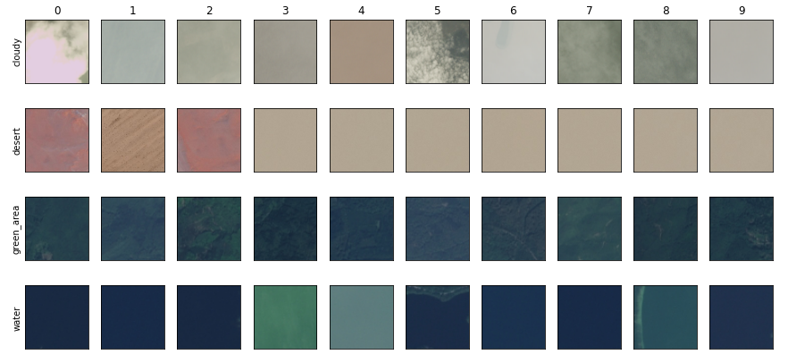

# Space Image Analysis and Modeling

This mini-project analyzes and models the images contained in the Kaggle dataset [Satellite Image Classification](https://www.kaggle.com/datasets/mahmoudreda55/satellite-image-classification).

The notebook [`space_image_analysis.ipynb`](./space_image_analysis.ipynb) has the fllowing sections:

1. Introduction: Explore the Dataset
2. Data Loaders
3. Model Definition
   - 3.1 Simple CNN
   - 3.2 Loss Function and Optimizer
   - 3.3 Persistence/Loading Functions
4. Training
   - 4.1 Visualize Training Results
5. Evaluate
6. Inference Functions

The dataset has 5631 images of 4 classes distributed as follows:

```
Class cloudy: 1500 images
Class desert: 1131 images
Class green_area: 1500 images
Class water: 1500 images
Total number of images: 5631
```



The defined model is a very simple CNN with 4 convolution-maxpool layers which achieves a good performance on the test split:

```
              precision    recall  f1-score   support

           0       0.97      0.97      0.97       146
           1       0.95      0.97      0.96       106
           2       0.93      0.91      0.92       172
           3       0.89      0.91      0.90       139

    accuracy                           0.93       563
   macro avg       0.94      0.94      0.94       563
weighted avg       0.93      0.93      0.93       563
```

However, the model training seems to be quite unstable, since re-training a new network leads to very different results.

